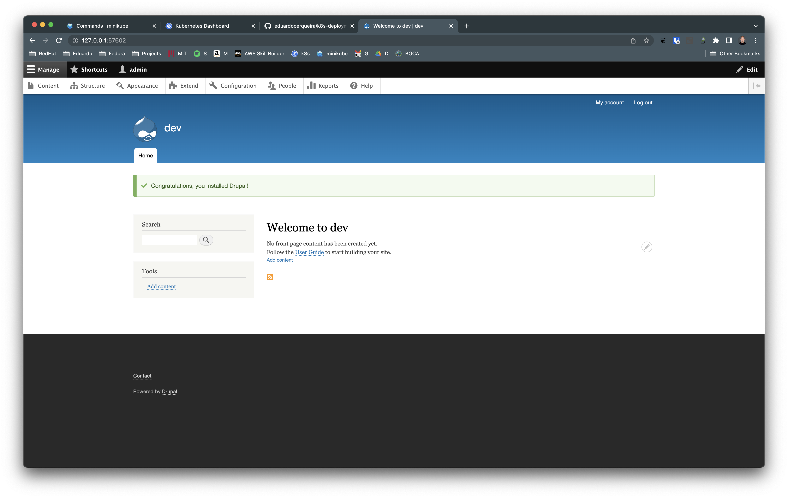

# Drupal on minikube

pre-requisite:
- minikube up and running
- kubectl installed

```
cd app/drupal
kubectl apply -f namespace.yaml
kubectl apply -f pvc.yaml
kubectl apply -f mysql.yaml
kubectl apply -f drupal.yaml
minikube service -n drupal drupal --url

# access the url below and fill out the credentials as following
http://127.0.0.1:57602

database_username: root             # it is default
database_password: root_password    # from mysql.yaml MYSQL_ROOT_PASSWORD
database_host: mysql                # from mysql.yaml containers name
```

# screenshots



